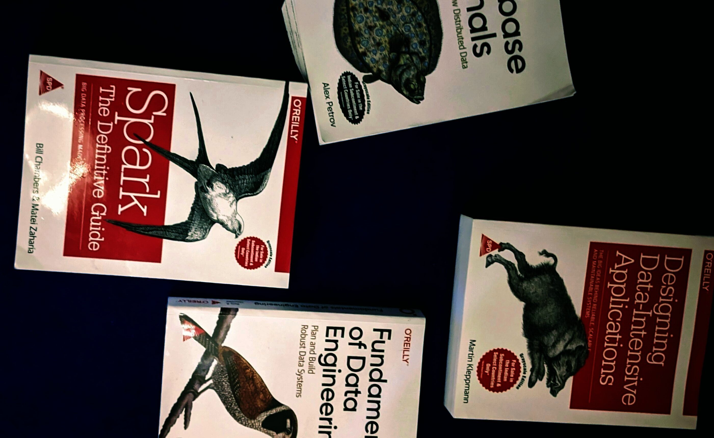

Hi, There! Apart from coding in python, I tinker with Go and Linux. I love anything to do with data, automation and cloud.

I first started my Linux journey in 2019 with Manjaro. Then did a custom Arch install and have been using Fedora for the past 2 years on my personal day to day machine. Now I can succesfully exit vim correctly and currently using Arch Linux btw!

I like going to gym, and an evening nature walk is all I need for a stressbuster. 

I occasionally game on my Xbox Series S.

Whenever I get time, I try to keep myself updated with latest technologies through blogs and books. I'm currently reading these series of books that are highly recommended in Data Engineering domain.

