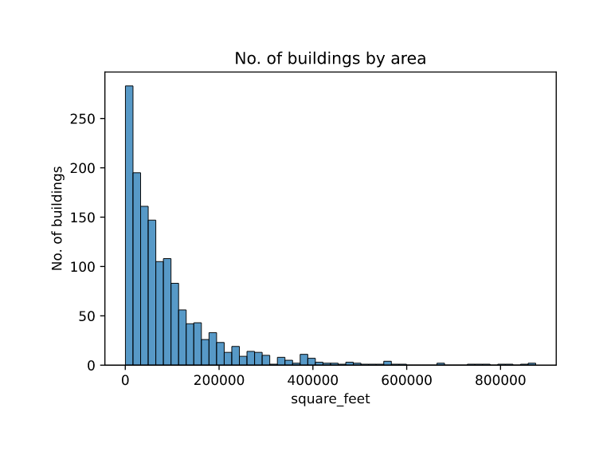

## Introduction

Modern buildings use a lot of Electrical energy for various applications like heating, cooling, steam and electrical usage. Modern Electrical retrofits can improve the Electrical power efficiency and reduce Electrical consumption and cost. 


But these retrofits in the scale of a large building can be quite expensive. So, instead of paying the price for retrofits upfront; customers can be billed as if the retrofits were not fit for a certain period; till the equipment costs are recovered.

> *"Retrofitting"* - refers to the process of updating older equipment with new technology.

Let's assume these variables to be `true_cost` and `assumed_cost`.

where:

- `true_cost` is the actual electrical consumption after retrofits and
- `assumed_cost` is the electricity that the building would consume if there were no retrofits.

The problem at hand is we might not have the historical `assumed_cost` information. But we have historical data of electrical consumption for over 1000 buildings over a year's period. The task is to then predict the `assumed_cost` for a new building using the historical data provided for 1000 buildings.

This [competition](https://www.kaggle.com/c/ashrae-energy-prediction/overview){:target="_blank"} was conducted on Kaggle by **ASHRAE** (*American Society of Heating and Air-Conditioning Engineers*) on October 15 2019.

### Performance Metric

The performance metric used in this competition is Root Mean Square Logarithmic Error (RMSLE). It is similar to RMSE but uses natural logarithm - $$ \log_e $$ or $$\ln$$ of the terms instead of the raw terms. $$ +1 $$ is added so that we do not encounter $$ \log_e0 $$.


*Root Mean Square Error* (**RMSE**):

$$\sqrt{\frac{1}{N}\sum_{i=1}^N{(p_i-a_i)^2}}$$

*Root Mean Square Logarithmic Error* (**RMSLE**):

$$\sqrt{\frac{1}{N}\sum_{i=1}^N{(\log(p_i+1)-\log(a_i+1))^2}}$$

where:

- $$p_i$$ are predicted values and

- $$a_i$$ are actual values.

RMSLE also penalizes underestimation more than overestimation. For example, $$(\ln 55 - \ln 60)^2 > (\ln 65 - \ln 60)^2$$. The loss (RMSLE) is more when the model predicts 55 than when model predicts 65, when true target is 60.

Since meter readings(target variable) range from $$0$$ to $$10^8$$ and we also do not want to underestimate, this metric is suitable for this problem. 

Overestimation is better than underestimation in this problem since in cost financing underestimation would result in customer paying less than their electric consumption cost.

## Business Problem

A accurate model would provide better incentives for customers to switch to retrofits. 

Predicting accurately will smoothen the customer onboarding process and will result in increase in customers. 

This is because a good model's predictions will result in customers paying the bill amount almost equal to what they would've payed if there were no retrofits; resulting in customers not having to change their expenditures. There are no strict latency requirements.

## Preliminary data analysis

This [dataset](https://www.kaggle.com/c/ashrae-energy-prediction/data){:target="_blank"} has 5 files:

- building_metadata.csv

- train.csv

- test.csv

- weather_test.csv

- weather_train.csv

#### building_metadata.csv

Shape : (1449, 6)

Few random rows from buildnig_metadata,

| site_id | building_id | primary_use         | square_feet | year_built | floor_count |
|:-------:|:-----------:|:-------------------:|:-----------:|:----------:|:-----------:|
| 0       | 1           | Education           | 7432        | 2008       |             |
| 0       | 6           | Lodging/Residential | 27926       | 1981       |             |
| 1       | 148         | Office              | 174601      | 1960       | 12          |

1. `site_id` : 
   
   - unique id of the site. Is an integer from 0 to 15
   - A site consists of a group of buildings in same geographical location with same weather.

2. `building_id` :
   
   - unique id of the building. Is an integer from 0 to 1448

3. `primary_use` :
   
   - use of the building. Is a categorical feature of 16 different types out of which `Education` (38%) and `Office` (19%) are majority features.

    ```python
    >>> building_metadata["primary_use"].unique()
    array(['Education', 'Lodging/residential', 'Office',
           'Entertainment/public assembly', 'Other', 'Retail', 'Parking',
           'Public services', 'Warehouse/storage', 'Food sales and service',
           'Religious worship', 'Healthcare', 'Utility', 'Technology/science',
           'Manufacturing/industrial', 'Services'], dtype=object)
    >>> len(building_metadata["primary_use"].unique())
    16
    ```

4. `square_feet` :
   
   - Area of building in sq. feet. Is a number ranging from 283 to 875000

5. `year_built` :
   
   - Built on this year.Is an integer from 1900 to 2007 with about 53% of data having missing values.

6. `floor_count` :
   
   - No. of floors in the building. Is an integer from 1 to 26 with about 76% of data having missing values.
   
#### train.csv:

Shape : (20216100, 4)


Few rows from `train.csv`

| building_id | meter | timestamp                | meter_reading |
|:-----------:|:----- |:------------------------ |:-------------:|
| 45          | 0     | 2016-01-01 <br> 00:00:00 | 0.0           |
| 46          | 0     | 2016-01-01 <br> 00:00:00 | 53.2397       |
| 137         | 0     | 2016-03-25 <br> 15:00:00 | 50.5156       |

1. `building_id` :
   
   - is the primary key for `building_metadata.csv`
   - each building has an unique id ranging from 0 to 1448

2. `meter` :
   
   - is a integer from 0 to 3 indicating one of 4 kinds of meters
   
   - 0,1,2,3 meters are in decreasing order of majority

3. `timestamp` :
   
   - is a timestamp from Jan 1 2016 00:00:00 to Dec 31 2016 23:00:00
   
   - format is in YYYY-MM-DD, HH:MM:SS where HH is a 24-hr format

4. `meter_reading` :
   
   - is a reading from meter in kWh/kBTU ranging from 0 to 21904700
   
   - This is hourly reading of the respective meter.

#### test.csv:

`test.csv` has all columns of `train.csv` except `meter_reading` column is absent and `timestamp` of next 2 years i.e from Jan 2017 to Dec 2018. This data has to used for prediction to make final submission on kaggle.

Shape : (41697600, 4)

#### weather_train.csv, weather_test.csv:


Few random rows from weather_train.csv

|site_id| timestamp| air_temperature | cloud_coverage | dew_temperature | precip_depth_1_hr | sea_level_pressure | wind_direction| wind_speed|
|:-----:|:---------:|:--------------:|:--------------:|:---------------:|:-----------------:|:------------------:|:-------------:|:----------|
|0	|2017-01-09 03:00:00|5.6|0.0|0.6|0.0|1035.5|360.0|5.1|
|5	|2017-01-02 00:00:00|3.0|0.0|1.0 | | |40.0|8.2|
|7	|2017-01-02 03:00:00|-10.4| |-11.4| |1027.5|360.0|1.0|

Both files have 9 columns.

1. `site_id`:
   
   - is same column discussed before

2. `timestamp`:
   
   - For weather_train data, it is same as timestamp of train.csv
   
   - For weather_test data, it is timestamp of test.csv

3. `air_temperature`:
   
   - Represents air temperature in celsius.

4. `cloud_coverage`:
   
   - Represents cloud coverage in okta (0~9). About 50% of data is missing.

5. `dew_temperature`:
   
   - Represents dew point temperature.

6. `precip_depth_1_h`:
   
   - Represents depth of precipitation and about 34% of data is missing

7. `sea_level_pressure`:
   
   - Represents sea level pressure


8. `wind_direction`:
   
   - Represents direction of wind from 0 to 360

9. `wind_speed`:
   
   - Represents wind speed. Looks like reading are in miles per hour

## Exploratory data analysis


