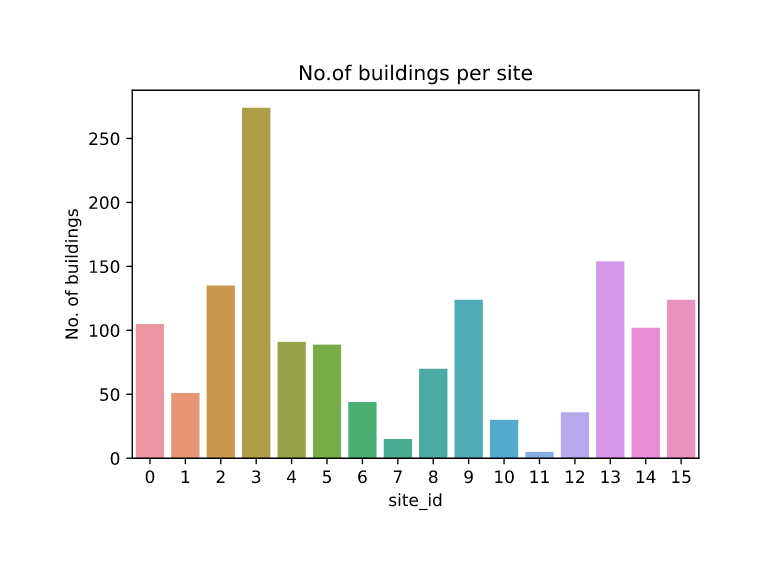
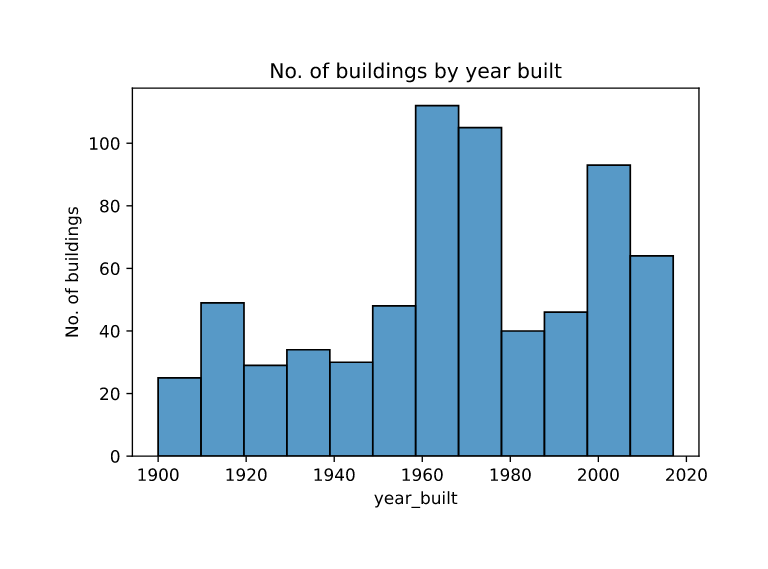
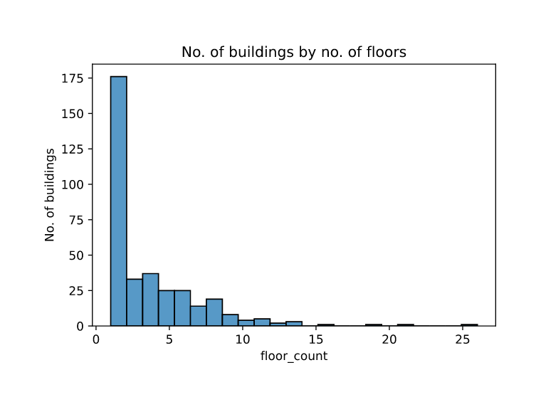
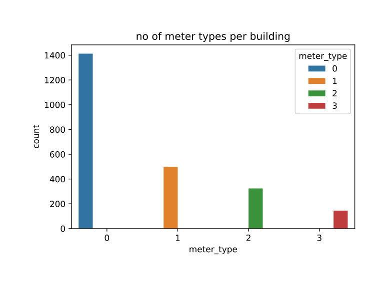
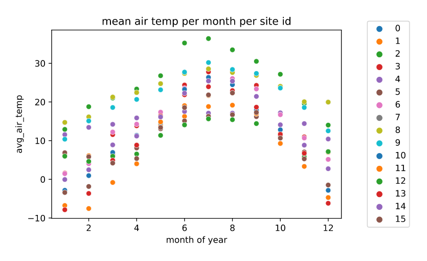
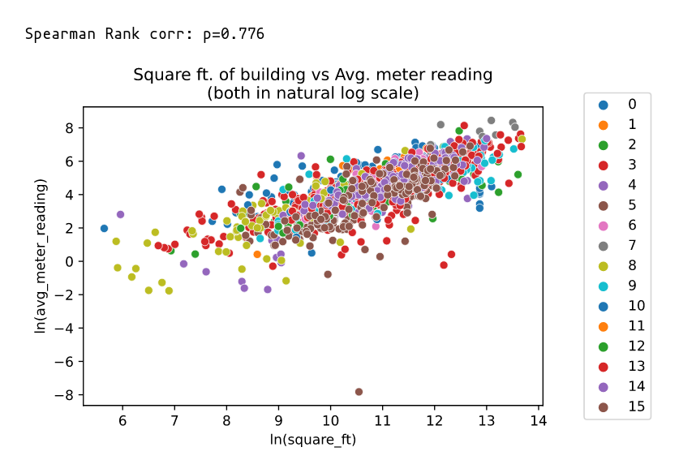
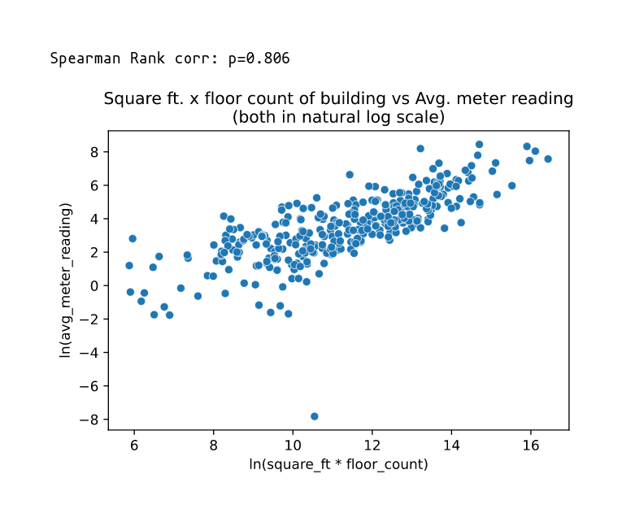
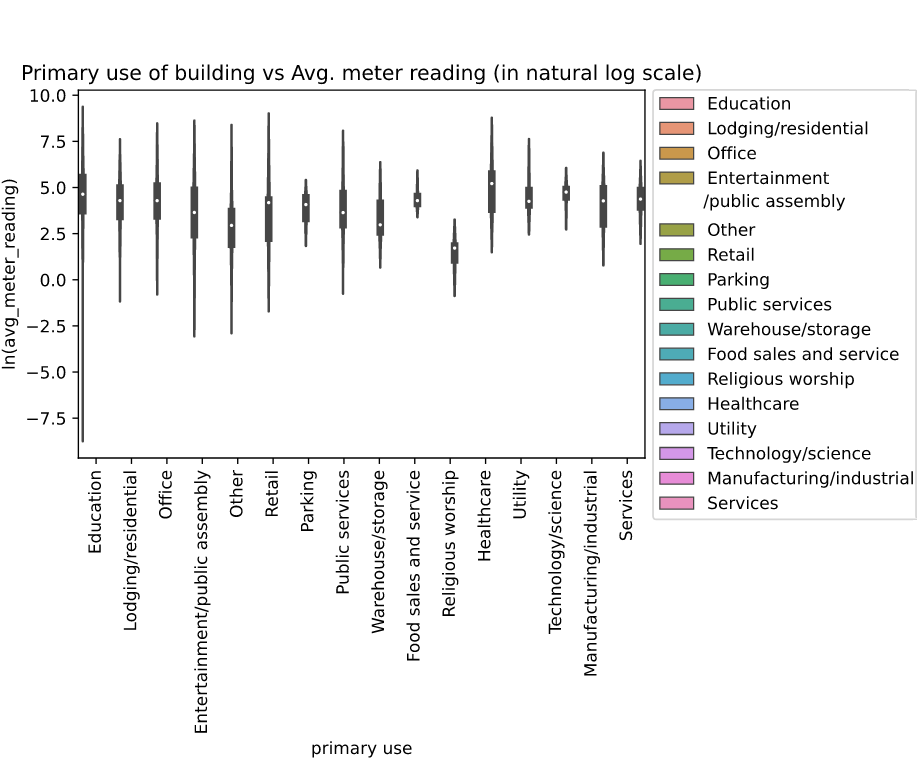
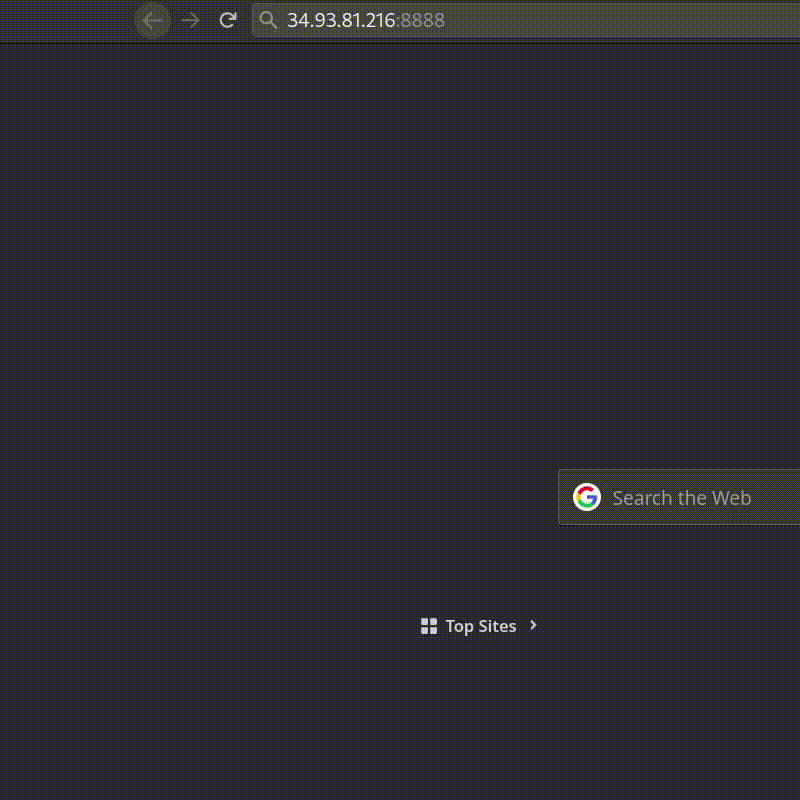

## Introduction

Modern buildings use a lot of Electrical energy for various applications like heating, cooling, steam and electrical usage. Modern Electrical retrofits can improve the Electrical power efficiency and reduce Electrical consumption and cost. 


But these retrofits in the scale of a large building can be quite expensive. So, instead of paying the price for retrofits upfront; customers can be billed as if the retrofits were not fit for a certain period; till the equipment costs are recovered.

<!--more-->

> *"Retrofitting"* - refers to the process of updating older equipment with new technology.

Let's assume these variables to be `true_cost` and `assumed_cost`.

where:

- `true_cost` is the actual electrical consumption after retrofits and
- `assumed_cost` is the electricity that the building would consume if there were no retrofits.

The problem at hand is we might not have the historical `assumed_cost` information. But we have historical data of electrical consumption for over 1000 buildings over a year's period. The task is to then predict the `assumed_cost` for a new building using the historical data provided for 1000 buildings.

This [competition](https://www.kaggle.com/c/ashrae-energy-prediction/overview){:target="_blank"} was conducted on Kaggle by **ASHRAE** (*American Society of Heating and Air-Conditioning Engineers*) on October 15 2019.

### Performance Metric

The performance metric used in this competition is Root Mean Square Logarithmic Error (RMSLE). It is similar to RMSE but uses natural logarithm - $$ \log_e $$ or $$\ln$$ of the terms instead of the raw terms. $$ +1 $$ is added so that we do not encounter $$ \log_e0 $$.


*Root Mean Square Error* (**RMSE**):

$$\sqrt{\frac{1}{N}\sum_{i=1}^N{(p_i-a_i)^2}}$$

*Root Mean Square Logarithmic Error* (**RMSLE**):

$$\sqrt{\frac{1}{N}\sum_{i=1}^N{(\log(p_i+1)-\log(a_i+1))^2}}$$

where:

- $$p_i$$ are predicted values and

- $$a_i$$ are actual values.

RMSLE also penalizes underestimation more than overestimation. For example, $$(\ln 55 - \ln 60)^2 > (\ln 65 - \ln 60)^2$$. The loss (RMSLE) is more when the model predicts 55 than when model predicts 65, when true target is 60.

Since meter readings(target variable) range from $$0$$ to $$10^8$$ and we also do not want to underestimate, this metric is suitable for this problem. 

Overestimation is better than underestimation in this problem since in cost financing underestimation would result in customer paying less than their electric consumption cost.

## Business Problem

A accurate model would provide better incentives for customers to switch to retrofits. 

Predicting accurately will smoothen the customer onboarding process and will result in increase in customers. 

This is because a good model's predictions will result in customers paying the bill amount almost equal to what they would've payed if there were no retrofits; resulting in customers not having to change their expenditures. There are no strict latency requirements.

## Preliminary data analysis

This [dataset](https://www.kaggle.com/c/ashrae-energy-prediction/data){:target="_blank"} has 5 files:

- building_metadata.csv

- train.csv

- test.csv

- weather_test.csv

- weather_train.csv

#### building_metadata.csv

Shape : (1449, 6)

Few random rows from buildnig_metadata,

| site_id | building_id | primary_use         | square_feet | year_built | floor_count |
|:-------:|:-----------:|:-------------------:|:-----------:|:----------:|:-----------:|
| 0       | 1           | Education           | 7432        | 2008       |             |
| 0       | 6           | Lodging/Residential | 27926       | 1981       |             |
| 1       | 148         | Office              | 174601      | 1960       | 12          |

1. `site_id` : 
   
   - unique id of the site. Is an integer from 0 to 15
   - A site consists of a group of buildings in same geographical location with same weather.

2. `building_id` :
   
   - unique id of the building. Is an integer from 0 to 1448

3. `primary_use` :
   
   - use of the building. Is a categorical feature of 16 different types out of which `Education` (38%) and `Office` (19%) are majority features.

    ```python
    >>> building_metadata["primary_use"].unique()
    array(['Education', 'Lodging/residential', 'Office',
           'Entertainment/public assembly', 'Other', 'Retail', 'Parking',
           'Public services', 'Warehouse/storage', 'Food sales and service',
           'Religious worship', 'Healthcare', 'Utility', 'Technology/science',
           'Manufacturing/industrial', 'Services'], dtype=object)
    >>> len(building_metadata["primary_use"].unique())
    16
    ```

4. `square_feet` :
   
   - Area of building in sq. feet. Is a number ranging from 283 to 875000

5. `year_built` :
   
   - Built on this year.Is an integer from 1900 to 2007 with about 53% of data having missing values.

6. `floor_count` :
   
   - No. of floors in the building. Is an integer from 1 to 26 with about 76% of data having missing values.
   
#### train.csv:

Shape : (20216100, 4)


Few rows from `train.csv`

| building_id | meter | timestamp                | meter_reading |
|:-----------:|:----- |:------------------------ |:-------------:|
| 45          | 0     | 2016-01-01 <br> 00:00:00 | 0.0           |
| 46          | 0     | 2016-01-01 <br> 00:00:00 | 53.2397       |
| 137         | 0     | 2016-03-25 <br> 15:00:00 | 50.5156       |

1. `building_id` :
   
   - is the primary key for `building_metadata.csv`
   - each building has an unique id ranging from 0 to 1448

2. `meter` :
   
   - is a integer from 0 to 3 indicating one of 4 kinds of meters
   
   - 0,1,2,3 meters are in decreasing order of majority

3. `timestamp` :
   
   - is a timestamp from Jan 1 2016 00:00:00 to Dec 31 2016 23:00:00
   
   - format is in YYYY-MM-DD, HH:MM:SS where HH is a 24-hr format

4. `meter_reading` :
   
   - is a reading from meter in kWh/kBTU ranging from 0 to 21904700
   
   - This is hourly reading of the respective meter.

#### test.csv:

`test.csv` has all columns of `train.csv` except `meter_reading` column is absent and `timestamp` of next 2 years i.e from Jan 2017 to Dec 2018. This data has to used for prediction to make final submission on kaggle.

Shape : (41697600, 4)

#### weather_train.csv, weather_test.csv:


Few random rows from weather_train.csv

|site_id| timestamp| air_temperature | cloud_coverage | dew_temperature | precip_depth_1_hr | sea_level_pressure | wind_direction| wind_speed|
|:-----:|:---------:|:--------------:|:--------------:|:---------------:|:-----------------:|:------------------:|:-------------:|:----------|
|0	|2017-01-09 03:00:00|5.6|0.0|0.6|0.0|1035.5|360.0|5.1|
|5	|2017-01-02 00:00:00|3.0|0.0|1.0 | | |40.0|8.2|
|7	|2017-01-02 03:00:00|-10.4| |-11.4| |1027.5|360.0|1.0|

Both files have 9 columns.

1. `site_id`:
   
   - is same column discussed before

2. `timestamp`:
   
   - For weather_train data, it is same as timestamp of train.csv
   
   - For weather_test data, it is timestamp of test.csv

3. `air_temperature`:
   
   - Represents air temperature in celsius.

4. `cloud_coverage`:
   
   - Represents cloud coverage in okta (0~9). About 50% of data is missing.

5. `dew_temperature`:
   
   - Represents dew point temperature.

6. `precip_depth_1_h`:
   
   - Represents depth of precipitation and about 34% of data is missing

7. `sea_level_pressure`:
   
   - Represents sea level pressure


8. `wind_direction`:
   
   - Represents direction of wind from 0 to 360

9. `wind_speed`:
   
   - Represents wind speed. Looks like reading are in miles per hour

## Exploratory data analysis


**No. of Buildings per site**:



- There is a large variation of sites with no. of buildings

- We observe most sites to have about 50-150 buildings.

- Site no. 3 has most no. of buildings and Sites 11,7,10,12 have few no. of buildings.


**No. of Buildings by usage**:


- Most buildings are used for Educational purposes and office purposes

- So we might expect majority of buildings to have most electrical load from 9:00 to 18:00

- We might also expect to have most buildings where vacation months have low consumption.


**No. of Buildings by area**:


- Most building's area are less than 100,000

- Area of building can correlate with no. of occupants and electrical consumption.


**No. of Buildings by year**:




- We observe a spike in no. of buildings built in around 1960-1980 and after 2000.

- We can expect some correlation with year built and power consumption, since newer equipment is usually more power efficienct.


**No. of Buildings by floors**:




- floor count data can give a precise indication of no. of occupants when combined with area of building data.

- But this data has high number (75%) of NaN values which may prevent us to fully take advantage of this feature.


**No. of meter types**:


|meter_type|count|
|:--:|:----:|
|0 |1413|
|1 |498|
|2 |324|
|3 |145|


- 1413 buildings have Meter 0, which is the dominant meter.

- Whereas only 498, 324 and 145 buildings have Meter 1, Meter 2 and Meter 3 respectively.

- We can expect that meter 0 to be primary meter and meter 1,2 and 3 to be meters for specialised power usage scenarios.


**Air temperature at a site**:

Air temperature at site 0 for a period of 12 months:




- We observe seasonal effects, where temp. peaks at around June - July / september - october at most sites.

- We also observe daily day-night temperature fluctuations.

- We can expect air temperature to be a strong indicator of power consumption reading since high and low temperature days will result in high usage of cooling and heating systems.

This can become more clear when mean monthly temperatures are plotted for each site.



- We observe the expected trends where temperatures are peaked mid year.

**Building dimensions vs meter reading(avg)**:

We take mean meter readings for meter 0 per each building and plot it against square foot.

We transform both variables with $$\log_e$$ since they have a huge range.





- We see a high correlation among the two variables.

- We observe higher correlation when area and floor_count are combined.

**Primary use vs meter reading(avg)**:




- We observe religious worship to have lower average when compared to toher categories of buildings.

- Educational type buildings have huge fluctuations in mean monthly power consumption data. This could be due to very low consumption in semester break months. And education buildings differ vastly in size and capacity.

- Food sales and service has lowest fluctuation may be beacuse these operate almost daily for a fixed amount of time.


**Meter readings of a building**:

Meter readings of building 965 for a period of 12 months:



- We observe meter readings for the building 965 for each of the 3 meters.
- We dont find any particular trend and that is expected because electrical consumption can be dependent on multiple factors.

## Feature Engineering

Before directly loading datasets and operating on them, we minify the dataset.

This is particularly important for this dataset as the files are large and any reduction will reduce memory consumption.

Minification:

```python

# Credit to kyakovlev; https://www.kaggle.com/kyakovlev/ashrae-data-minification
# Minifies dataset so that they use the least amount of memory they could, without data loss

def reduce_mem_usage(df, verbose=True):
    numerics = ['int16', 'int32', 'int64', 'float16', 'float32', 'float64']
    # Bytes to MB
    start_mem = df.memory_usage().sum() / 1024**2    
    for col in df.columns:
        col_type = df[col].dtypes
        if col_type in numerics:
            c_min = df[col].min()
            c_max = df[col].max()
            if str(col_type)[:3] == 'int':
                # np.iinfo() returns min and max limit of an int type
                if c_min > np.iinfo(np.int8).min and c_max < np.iinfo(np.int8).max:
                    df[col] = df[col].astype(np.int8)
                elif c_min > np.iinfo(np.int16).min and c_max < np.iinfo(np.int16).max:
                    df[col] = df[col].astype(np.int16)
                elif c_min > np.iinfo(np.int32).min and c_max < np.iinfo(np.int32).max:
                    df[col] = df[col].astype(np.int32)
                elif c_min > np.iinfo(np.int64).min and c_max < np.iinfo(np.int64).max:
                    df[col] = df[col].astype(np.int64)  
            else:
                if c_min > np.finfo(np.float16).min and c_max < np.finfo(np.float16).max:
                    df[col] = df[col].astype(np.float16)
                elif c_min > np.finfo(np.float32).min and c_max < np.finfo(np.float32).max:
                    df[col] = df[col].astype(np.float32)
                else:
                    df[col] = df[col].astype(np.float64)
          
    end_mem = df.memory_usage().sum() / 1024**2
    if verbose: print('Mem. usage decreased to {:5.2f} Mb ({:.1f}% reduction)'.format(end_mem, 100 * (start_mem - end_mem) / start_mem))
    return df
```

The above code works by reducing the datatypes for example, from `np.int16` to `np.int8` if a particular column's range can fit within the smaller datatype's range.

**Time Features**:

First, the timestamp column for all csv files is converted to `datetime` object

```python
def timestamp_to_date(df):#train_df, test_df, train_weather_df, test_weather_df
    df['timestamp'] = pd.to_datetime(df['timestamp'])
    return df
        
```

Alignment:

The timestamps of sites are not in their local times but in UTC. We know this due to peak temps occuring at various times other than afternoon times.

We correct timestamps so that peak temps occur at 14:00 to 15:00.
```python
import datetime

max_temp_hrs = []
for site in range(0,15+1):
    day = pd.Timestamp(datetime.datetime(2016, 1, 1))
    max_temp_hrs_per_day = []
    
    for _ in range(366):
        day_after = day + pd.Timedelta("1 day")
        df = train_weather[(train_weather["site_id"]==site) & \
        (train_weather["timestamp"] >= day) & \
        (train_weather["timestamp"] < day_after)][["timestamp", "air_temperature"]]
        
        loc = df["air_temperature"].idxmax()
        hour = df.loc[loc]["timestamp"].hour 
        day = day + pd.Timedelta("1 day")
        max_temp_hrs_per_day.append(hour)
    
    max_temp_hrs.append(max_temp_hrs_per_day)

from scipy.stats import mode

# We align so that all the mode of each sites peak temp time
# has to occur during the afternoon 13:00 to 15:00 time


max_temp = mode(np.array(max_temp_hrs),axis=1).mode.flatten()
sites = ["site_{}".format(i) for i in range(0,16)]
alignment = pd.DataFrame(zip(sites, max_temp),columns=["site_id","peak_temp_hr"])

def correction(hr):
    # peak afternoon hrs are not corrected
    if hr==13 or hr==14 or hr==15:
        return 0
    
    # These sites are in mountain locs and we set peak at 16:00 by -8
    elif hr==0:
        return -8
    
    # For rest of the sites, we align to 15:00
    else:
        return 15-hr

alignment["correction"] = alignment["peak_temp_hr"].apply(correction)

# Algning timezone for test data
train_weather_copy = train_weather.copy()
for site in range(0, 16):
    df = train_weather[train_weather["site_id"]==site]["timestamp"].apply(lambda x:x+pd.Timedelta("{} hr".format(alignment.iloc[site]["correction"])))
    train_weather_copy.loc[train_weather_copy["site_id"]==site, "timestamp"] = df

train_weather = train_weather_copy
del train_weather_copy
```

Following new time features are added:

- DT_M : Month of the year
- DT_W : Week of the year
- DT_D : Day of the year
- DT_hour : Hour of the day
- DT_day_week : Day of the week
- DT_day_month : Day of the month
- DT_week_month : Week of the month

```python

def new_time_features(df):#train_df, test_df
    df['DT_M'] = df['timestamp'].dt.month.astype(np.int8)
    df['DT_W'] = df['timestamp'].dt.weekofyear.astype(np.int8)
    df['DT_D'] = df['timestamp'].dt.dayofyear.astype(np.int16)
    
    df['DT_hour'] = df['timestamp'].dt.hour.astype(np.int8)
    df['DT_day_week'] = df['timestamp'].dt.dayofweek.astype(np.int8)
    df['DT_day_month'] = df['timestamp'].dt.day.astype(np.int8)
    df['DT_week_month'] = df['timestamp'].dt.day/7
    df['DT_week_month'] = df['DT_week_month'].apply(lambda x: math.ceil(x)).astype(np.int8)
    return df
```

Cyclical features & weekend:

Applying cyclical time features for both test and train. Cyclical encoding of time feature ensures that 0 and 23 hr are close to each other. This involves `sine` and `cosine` transformation of hour variable.

A weekend feature is also added so that it is `True` or `1` if the day is Sat ot Sun.

```python
train_reduced["DT_h_sin"] = train_reduced["DT_hour"].apply(lambda x:np.sin(2*np.pi*x/24))
train_reduced["DT_h_cos"] = train_reduced["DT_hour"].apply(lambda x:np.cos(2*np.pi*x/24))

# Week days are coded as Mon:0,Tue:1,...Fri:4,Sat:5,Sun:6
train_reduced["weekend"] = train_reduced["DT_day_week"].apply(lambda x: int(x>=5))

test_reduced["DT_h_sin"] = test_reduced["DT_hour"].apply(lambda x:np.sin(2*np.pi*x/24))
test_reduced["DT_h_cos"] = test_reduced["DT_hour"].apply(lambda x:np.cos(2*np.pi*x/24))
test_reduced["weekend"] = test_reduced["DT_day_week"].apply(lambda x: int(x>=5))
```

**Label encoding of Primary use**:

Label Encoding is used to encode Primary use feature.

```python
from sklearn.preprocessing import LabelEncoder
le = LabelEncoder()
building_df['primary_use'] = building_df['primary_use'].astype(str)
building_df['primary_use'] = le.fit_transform(building_df['primary_use']).astype(np.int8)
```

**Dropping Few Site 0 data**:

- Almost all of readings from this site are zeros in the beggining of the year.
- We pick an arbitary date so that most no. of total readings are zeros and drop them from the train data.

```python
day = pd.Timestamp(datetime.datetime(2016, 5, 25))
df = train_reduced[(train_reduced["building_id"] < 105) & (train_reduced["timestamp"]<day)]
print("Total no. readings {}".format(len(df)))
print("Total no. of zero reading meters {}".format((df["meter_reading"]==0).sum()))
```
```
Total no. readings 404822
Total no. of zero reading meters 350360
```

By now we have finished adding new features and all the dataframes can be saved in pickle files.

**Log encoding**:

Before training the models, we transform the meter_reading value into $$\log_e(mr+1)$$  where $$mr$$ is `meter_reading` ; using `np.log1p()` (1p stands for "one plus"). This reduces the scale of the target variable and makes our models robust. This allows us to use RMSLE loss for training our models and this encoding greatly improved the leaderboard scores.

We also have to decode the values back to original scale $$e^t-1$$ where $$t$$ is the transformed variable; by using `np.expm1()` (m1 stands for "minus one").
```python
# encode
X = train.drop(columns=["timestamp","meter_reading"])

# converting meter_reading to y where y=log(meter_reading + 1)
y = np.log1p(train["meter_reading"])

# decode
pred = np.expm1(model.predict(test.drop(columns=["timestamp","row_id"])))
```

## Modeling

- We first write a few functions that will make predictions as per kaggle submission format and save our model to pickle file.
- We also convert .csv format to .7z to compress the final submission file using `p7zip` command.
- The `transform` parameter helps us reuse the same function for linear models where we might normalize the data.

```python
import time

# Function to make presiction and save it to csv file in kaggle submission format
def save_submission(model, extension="", transform=None):
    
    if transform is None:
        # Converting predictions into exp(x) - 1
        pred = np.expm1(model.predict(test.drop(columns=["timestamp","row_id"])))
    else:
        pred = np.expm1(model.predict(transform(test.drop(columns=["timestamp","row_id"]))))
        
    filename = time.strftime("%y-%m-%d-%H%M%S") + extension +".csv"

    # Saving predictions to csv file
    pd.DataFrame(pred, columns=["meter_reading"]).rename_axis("row_id").to_csv(filename)
    
    #converts the csv file to 7z to reduce size
    !p7zip $filename >> /dev/null
    print("{} saved!".format(filename))

# save model to disk in pickle format
def save_model(model, name="model.pkl"):
    with open("../models/" + name, "wb") as f:
        pickle.dump(model, f)
    print("{} saved to disk!".format(name))
```

**LGBM Model**:

Using Grid Search to find best params:

```python
param_grid = {
    "learning_rate" : [0.01],
    "n_estimators" : [512, 1024],
    "num_leaves" : [32,64],
    "objective" : ["regression"],
    "metric" : ["rmse"],
    "colsample_bytree": [0.9],
}

lgbm = LGBMRegressor()
grid = GridSearchCV(lgbm, param_grid, scoring="neg_mean_squared_error", cv=3, return_train_score=True)
grid.fit(X, y)
```
Best params:

```python
grid.best_params_
```

```
{'colsample_bytree': 0.9,
 'learning_rate': 0.01,
 'metric': 'rmse',
 'n_estimators': 1024,
 'num_leaves': 64,
 'objective': 'regression'}
```

Training using best params:
- Instead of training lgbm model on same object, we have created a new `lgb.Dataset()` object that also has `cateogrical_features` information that lgbm model can use.
- This slightly improved the performance.

```python
features = ['building_id', 'meter', 'DT_M', 'DT_W', 'DT_D', 'DT_hour',
       'DT_day_week', 'DT_day_month', 'DT_week_month', 'DT_h_sin', 'DT_h_cos',
       'weekend', 'site_id', 'primary_use', 'square_feet', 'year_built',
       'air_temperature', 'cloud_coverage', 'dew_temperature',
       'precip_depth_1_hr', 'sea_level_pressure', 'wind_direction',
       'wind_speed']

categorical_features = ['building_id', 'meter', 'DT_M', 'DT_W',
       'DT_D', 'DT_hour', 'DT_day_week', 'DT_day_month', 'DT_week_month', 'weekend',
       'site_id', 'primary_use', 'year_built']

train_data = lgb.Dataset(X,label=y, categorical_feature=categorical_features, feature_name=features)

param= {
    "learning_rate" : 0.01,
    "num_iterations" : 1024,
    "num_leaves" : 64,
    "objective" : "regression",
    "metric" : "rmse",
    "colsample_bytree": 0.9,

}

lgbm = lgb.train(param, train_data, categorical_feature=categorical_features, feature_name=features)

save_submission(lgbm, "lgbm")
save_model(lgbm,"lgbm.pkl")
```
- Since lgbm can handle missing values, imputation is not done for this model. 
- Doing Median imputation sligtly worsened the model performance. But it will be done for subsequent models.

Median Imputation:

```python
# all these are numerical features
features_to_impute = [
    "air_temperature",
    "cloud_coverage",
    "dew_temperature",
    "precip_depth_1_hr",
    "sea_level_pressure",
    "wind_direction",
    "wind_speed"
]

impute_vals = {}

# Median imputation

for site_id in range(0,15+1):
    site = {}
    for feature in features_to_impute:
        median = X[X["site_id"]==site_id][feature].median()
        median = 0 if np.isnan(median) else median
        site.update({feature : median})
      
    impute_vals.update({site_id : site})

# filling null values
for site_id in range(0, 15+1):
    df = X[X["site_id"]==site_id].fillna(impute_vals[site_id])
    X[X["site_id"]==site_id] = df
```

**Linear Model**:

Using grid search to find best params:

```python
param_grid = {
    'alpha' :[0.0001, 0.01, 0.1]
}

lin = SGDRegressor()
grid = GridSearchCV(lin, param_grid, scoring="neg_mean_squared_error", cv=3)
grid.fit(X ,y)
```
```python
grid.best_params_
```
```
{'alpha': 0.01}
```

Training a SGDRegressor using best params. We also use standardscaler to scale the data.

```python
from sklearn.preprocessing import StandardScaler
scaler = StandardScaler()

linear = SGDRegressor(alpha = 0.01, eta0=1e-5, learning_rate="constant")
linear.fit(scaler.fit_transform(X) ,y)

save_submission(linear, "_lin", scaler.transform)
save_model(linear,"linear.pkl")
```

**Decision Tree**:

```python
from sklearn.tree import DecisionTreeRegressor
dtr = DecisionTreeRegressor()
dtr.fit(X, y)

save_submission(dtr, "_dtr")
save_model(dtr,"dtr.pkl")
```

**Ada Boost**:
```python
from sklearn.ensemble import AdaBoostRegressor
ada = AdaBoostRegressor(n_estimators = 1000)
ada.fit(X, y)
save_model(ada,"ada.pkl")
save_submission(ada, "_ada")
```
Gridsearch is not used here due to hardware and memory limitations.

**MLP**:

A simple Multi layered perceptron architecture is used here, with ReLU activation and dropouts.

```python
import tensorflow as tf
import datetime

from tensorflow.keras.layers import Dense
from tensorflow.keras.layers import Dropout

from sklearn.model_selection import train_test_split

X_train, X_val, y_train, y_val = train_test_split(X, y, test_size=0.02, random_state=42)

model = tf.keras.Sequential([
    Dense(23, activation='relu'),
    Dense(256, activation='relu'),
    Dense(256, activation='relu'),
    Dense(128, activation='relu'),
    Dense(128, activation='relu'),
    Dropout(0.2),
    Dense(64, activation='relu'),
    Dense(32, activation='relu'),
    Dense(16, activation='relu'),
    Dense(8, activation='relu'),
    Dropout(0.2),
    Dense(4, activation='relu'),
    Dense(2, activation='relu'),
    Dense(1)
    ])

model.compile(optimizer='adam',
            loss=tf.keras.losses.MeanSquaredError(),
            metrics=tf.keras.losses.MeanSquaredError())

model.fit(X_train, y_train)

log_dir = "logs/fit/" + datetime.datetime.now().strftime("%Y%m%d-%H%M%S")
tensorboard_callback = tf.keras.callbacks.TensorBoard(log_dir=log_dir, histogram_freq=1)

model.fit(X, y, epochs=4, callbacks=[tensorboard_callback],batch_size = 512, validation_data=(X_val, y_val), validation_batch_size=64)
model.save('mlp')
save_submission(model, "_mlp")
```

**Stacking**:

A custom stacking regressor is built using saved adaboost, lgbm and linear model as base models. For the final meta model a linear model is used.

```python
with open("ada.pkl", "rb") as f:
    ada = pickle.load(f)

with open("lgbm.pkl", "rb") as f:
    lgbm = pickle.load(f)

with open("linear.pkl", "rb") as f:
    linear = pickle.load(f)
    
def return_train_prediction(model, transform=None):
    
    if transform is None:
        return model.predict(X)
    else:
        return model.predict(transform(X))

from sklearn.preprocessing import StandardScaler
scaler = StandardScaler()
scaler.fit(X)
        
base = [ada, lgbm, linear]
transforms=[None, None, scaler.transform]
meta = SGDRegressor(alpha = 0.01, eta0=1e-5, learning_rate="constant")

base_pred = np.zeros((X.shape[0],len(base)), dtype='float')

for i,(m,t) in enumerate(zip(base, transforms)):
    base_pred[:,i] = return_train_prediction(m, t)

meta.fit(base_pred, y)

# saving model
save_model(meta,"meta.pkl")

# predictions
base_pred = np.zeros((test.shape[0],len(base)), dtype='float')
    
def return_test_prediction(model, transform=None):
    
    if transform is None:
        return model.predict(test.drop(columns=["timestamp","row_id"]))
    else:
        return model.predict(transform(test.drop(columns=["timestamp","row_id"])))
    
for i,(m,t) in enumerate(zip(base, transforms)):
    base_pred[:,i] = return_test_prediction(m, t)

filename = time.strftime("%y-%m-%d-%H%M%S") + "_meta" +".csv"
pd.DataFrame(np.expm1(meta.predict(base_pred)), columns=["meter_reading"]).rename_axis("row_id").to_csv(filename)
print(f"{filename} saved!")
!p7zip $filename >> /dev/null
```
## Submission results

After submitting the saved 7z files to kaggle, here are the final leaderboard results:

|Model|Public|Private|
|:----:|:---:|:-----:|
|lgbm|1.360|1.146|
|linear|2.192|1.190|
|decision tree|1.676|1.412|
|adaboost|2.108|1.964|
|mlp|2.335|2.136|
|stacking|1.388|1.158|

The best model *lgbm* gave 

Public lb : 1.360 and 

Private lb: 1.146


This model can now be deployed to cloud.

## Deployment

- The lgbm model is deplyed to Google Cloud Platform using E2 2vCpu 1GB Ram Debian 10 Machine.
- Flask and waitress is used for backend. For frontend vue.js is used for form validation and conditional dropdown.

app.py
```python
import flask
from flask import Flask, jsonify, request
from waitress import serve
import pandas as pd
import pickle
import numpy as np
import math
import lightgbm

app = Flask(__name__)

@app.route('/')
def index():
    return flask.render_template("index.html")

def timefeatures(timestamp):
    # time features

    DT_M = timestamp.dt.month.astype(np.int8)
    DT_W = timestamp.dt.isocalendar().week.astype(np.int8)
    DT_D = timestamp.dt.dayofyear.astype(np.int16)
    
    DT_hour = timestamp.dt.hour.astype(np.int8)
    DT_day_week = timestamp.dt.dayofweek.astype(np.int8)
    DT_day_month = timestamp.dt.day.astype(np.int8)
    DT_week_month = timestamp.dt.day/7
    DT_week_month = DT_week_month.apply(lambda x: math.ceil(x)).astype(np.int8)
    
    DT_h_sin = DT_hour.apply(lambda x:np.sin(2*np.pi*x/24))
    DT_h_cos = DT_hour.apply(lambda x:np.cos(2*np.pi*x/24))

    # Week days are coded as Mon:0,Tue:1,...Fri:4,Sat:5,Sun:6
    weekend = DT_day_week.apply(lambda x: int(x>=5))
    
    return list(map(lambda x:x.to_numpy()[0],[DT_M, DT_W, DT_D, DT_hour, DT_day_week, DT_day_month, DT_week_month, DT_h_sin, DT_h_cos, weekend]))

def weatherfeatures(response):
    none_check_float = lambda x: None if not x else float(x)
    air_temperature = response['air_temperature']
    cloud_coverage = response['cloud_coverage']
    dew_temperature = response['dew_temperature']
    precip_depth_1_hr = response['dew_temperature']
    sea_level_pressure = response['sea_level_pressure']
    wind_direction = response['wind_direction']
    wind_speed = response['wind_speed']
    return list(map(none_check_float, [air_temperature,cloud_coverage,dew_temperature,precip_depth_1_hr,sea_level_pressure,wind_direction,wind_speed]))

@app.route("/predict", methods=['POST'])
def predict():
    response = request.form.to_dict()

    with open("./models/labelencoder.pkl", "rb") as f:
        le = pickle.load(f)

    with open("./models/lgbm.pkl", "rb") as f:
        lgbm = pickle.load(f)
    

    building_metadata = pd.read_csv("./data/building_metadata.csv")
    building_id = int(response["building"])
    
    meter = int(response["meter"])
    site_id = int(response["site"])
    
    df = building_metadata[building_metadata["building_id"]==building_id].to_dict(orient="list")
    df = {k:v[0] for k,v in df.items()}

    primary_use = int(le.transform(np.array(df['primary_use']).reshape(1,)).astype(np.int8)[0])
    
    square_feet = df['square_feet']
    square_feet = None if np.isnan(square_feet) else square_feet
    
    year_built = df['year_built']
    year_built = None if np.isnan(year_built) else year_built

    response.update({"primary_use" : primary_use, "square_feet" : square_feet, "year_built" : year_built})
    
    try:
        timestamp = pd.to_datetime(pd.Series(response["timestamp"]))
    except:
        return f'{response["timestamp"]} is Invalid timestamp!'
    
    encoded = [building_id] + [meter] + timefeatures(timestamp) + [site_id, primary_use, square_feet, year_built] + weatherfeatures(response)
    meter_reading = np.expm1(lgbm.predict(np.array(encoded).reshape(1,-1))[0])
    return {"meter_reading" : meter_reading}

if __name__ == "__main__":
    serve(app, host="0.0.0.0", port=8888)
```
For all deployment related files click [here](https://github.com/brpy/ashrae-energy-prediction/tree/master/deployment){:target="_blank"}

Final working of deployed app:



## Conclusions & Future Work

- A single Lgbm model performed very well considering that leak data is not used.
- With better hardware, each unique lgbm per meter type or site or building can be built to improve performance further.
- This works because each lgbm model can capture the pattern of each meter, site or building.
- A custom ensembling of many such lgbm and other models can be used for final prediction.

## Profile

Github Repo : [https://github.com/brpy/ashrae-energy-prediction](https://github.com/brpy/ashrae-energy-prediction){:target="_blank"}

LinkedIn : [https://www.linkedin.com/in/bhargav-chowdary-714b1b6a/](https://www.linkedin.com/in/bhargav-chowdary-714b1b6a/){:target="_blank"}

### *References:*

- [Encoding Cyclical Features for Deep Learning - Kaggle](https://www.kaggle.com/avanwyk/encoding-cyclical-features-for-deep-learning){:target="_blank"}
- [Aligned Timestamp - LGBM by meter type - Kaggle](https://www.kaggle.com/nz0722/aligned-timestamp-lgbm-by-meter-type){:target="_blank"}
- [Estimating Counterfactual Energy Usage of Buildings with Machine Learning - Medium](https://towardsdatascience.com/estimating-counterfactual-energy-usage-of-buildings-with-machine-learning-8ca91ec66c08){:target="_blank"}
- [More Buildings Make More Generalizable Models—Benchmarking Prediction Methods on Open Electrical Meter Data](https://www.mdpi.com/2504-4990/1/3/56){:target="_blank"}
- [kaggle 1st place](https://www.kaggle.com/c/ashrae-energy-prediction/discussion/124709){:target="_blank"}
- [Strategy evaluation: What helps and by how much? - Kaggle](https://www.kaggle.com/purist1024/strategy-evaluation-what-helps-and-by-how-much/){:target="_blank"}
- [ASHRAE - Data minification - Kaggle](https://www.kaggle.com/kyakovlev/ashrae-data-minification){:target="_blank"}
- [Applied Ai Course](https://appliedaicourse.com){:target="_blank"}
